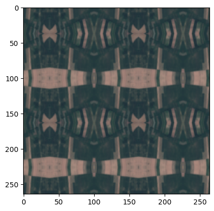
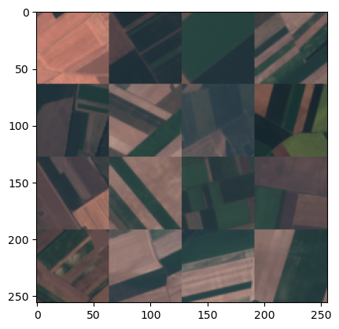

# Concept discovery on jUngleNet using TCAV
TCAV can be used to test the sensitivity of model predictions against different concepts. The method is introduced by Been Kim et al. in their paper ["Interpretability Beyond Feature Attribution: Quantitative Testing with Concept Activation Vectors (TCAV)"](https://arxiv.org/abs/1711.11279). We want to apply this method to a remote sensing application. This project focusses on jUngleNet, a convolutional neural network designed to distinguish anthropogenic areas from wilderness. It consists of a U-Net at the beginning, followed by a small classificator block. jUngleNet is developed by Timo Stomberg et al. and introduced in their paper ["Exploring Wilderness Characteristics Using Explainable Machine Learning in Satellite Imagery"](https://arxiv.org/abs/2203.00379). The code for this paper is available [here](https://gitlab.jsc.fz-juelich.de/kiste/asos). 
The goal of this project is to detect whether the CNN has learned different concepts and to quantify how much they contribute to the decision making process.

This project was part of the Explainable Machine Learning seminar by Ribana Roscher, University of Bonn.

# Requirements
In order to be able to use jUngleNet, the tlib library has to be installed according to the installation instructions available [here](https://gitlab.jsc.fz-juelich.de/kiste/asos). If the application uses multispectral concepts with 10 bands, the pretrained model weights linked in the repository can be downloaded and used. Otherwise, the model might have to be retrained using less channels. In our experiments we used a model trained on RGB data that we received from Timo Stomberg.

Because TCAV needs data from the classes the concept sensitivity is tested on, the AnthroProtect dataset also has to be downloaded from [here](http://rs.ipb.uni-bonn.de/data/anthroprotect).

A TCAV implementation for PyTorch is available in the [Captum](https://github.com/pytorch/captum) library. This library can be installed using the `pip install captum` command.

To make the random datasets required for TCAV we found the `download_and_make_datasets.py` code from the Tensorflow implementation of TCAV helpful, available [here](https://github.com/tensorflow/tcav/tree/master/tcav/tcav_examples/image_models/imagenet).

# TCAV
The method TCAV can be used to analyse the decision process of a network. The method can be used to test the sensitivity of individual layers to certain human-friendly concepts. Besides the model and the model parameters of the trained network, data is needed. On the one hand, images of the concept to be tested and on the other hand, random images that do not represent any concept are needed. In addition, input images which have been used to train the network are needed. For the concepts and the random images the activations in the activation space of a selected layer can be computed. These activations are used to create a binary linear classifier that separates the activations of the concepts from those of the random images. The normal of the separating hyperplanes is called the Concept Activation Vector (CAV). The CAV and the training data are now used to compute directional derivatives. In order to be able to calculate statistical tests, the TCAV score is calculated, which indicates the fraction of positive directional derivatives. The higher the TCAV score, the more sensitive the layer is to the tested concept. To guarantee independence from the random sets, this is done for different random sets. With a two sample t-test it can be tested if TCAV score distribution from Concept is independent from TCAV score distribution from random images. Detailed information can be found [here](https://arxiv.org/abs/1711.11279).

# Data
We want to test two very different kinds of concepts. This contains more general concepts that are represented by textures like "chequered" or "grooved" from the [Describable Textures Dataset (DTD)](https://www.robots.ox.ac.uk/~vgg/data/dtd/) as well as some more specific concepts, namely land cover classes from the [Eurosat](https://github.com/phelber/EuroSAT#) dataset.

The fact that the jUngleNet model contains a linear layer has some implications for the shape of the concept image data. The model is usually trained for Sentinel-2 image patches of size 256 px x 256 px. This means that concept images have to be large enough to be cropped to this size. In case of the DTD images this is possible.
In case of smaller images like those from the Eurosat dataset, which have a size of 64 px x 64 px, other adaptations have to be made. Simply upscaling the image is probably not the best solution because the net only saw images with a spatial resolution of 10 m x 10 m during training.

  
   

Instead, we looked at two different solutions to handling this issue. The first solution (left) is simply mirroring the image patch along its borders. This yields some unrealistic patterns as the Eurosat image patch is so small that it is reproduced multiple times. 

In our eyes, stitching 16 Eurosat image patches together is the better solution here (right), as it retains realistic shapes and proportions.

# Experiments
## Describable Textures Dataset (DTD)
The Describable Textures Dataset provides images for several concepts. The dataset mainly contains images of objects with certain textures. An example is the chequered dataset. Figure??? shows the TCAV scores for all layers for the class anthropogenic and Figure???  for the class wilderness for the concept chequered. It can be seen that the TCAV scores are very similar. The same holds true for other concepts of the Describable Textures Dataset. For a two-class classification, one would expect that concepts that are sensitive to one class would not show the same sensitivity to the other class. The concepts of the Describable Textures Dataset do not seem to be suitable for finding concepts in the jUngle Net. This could be due to the fact that the kind of images is very different. The jUngle Net was trained with Sentinal 2 satellite images, while that of the Describable Textures Dataset are regular photos of objects.
## Eurosat Dataset
### Crop-like concepts
Crop-like, anthropogenic: The EuroSat dataset, unlike the Describable Textures dataset, provides labeled Sentinel 2 satellite images. With this data higher level concepts can be tested. As one concept, crop-like classes can be investigated. EuroSat provides three different crop classes, AnnualCrop, PermanentCrop and Pasture. All three classes are anthropogenic and not wilderness areas. For each class, TCAV scores are calculated on each layer to test sensitivity to antropogenic. The results are shown in Figure ???. Except for some minor differences, the TCAV scores are very similar. The TCAV scores are very high on most layers, indicating a sensitivity of the class antropogenic to crop like concepts. When taking a look at the TCAV scores in the encoder and decoder part of the U-net, it is remarkable that a systematic can be recognized in all three crop classes. In the encoder part, the TCAV score increases with each layer and in the decoder part it decreases with each layer. In other words, the smaller the output, the higher the TCAV score.
### City-like concepts
anthropogenic + residential, wilderness
### Forest
, anthropogenic + wilderness
### Herbaceous vegetation
, wilderness

# Summary
* TODO

# References
* 
