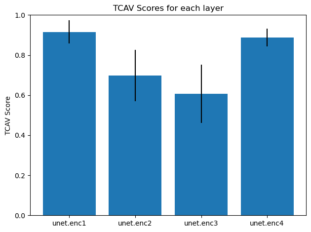

# Concept discovery on jUngle-Net using TCAV
TCAV can be used to test the sensitivity of model predictions against different concepts. The method is introduced by Been Kim et al. in their paper ["Interpretability Beyond Feature Attribution: Quantitative Testing with Concept Activation Vectors (TCAV)"](https://arxiv.org/abs/1711.11279). We want to apply this method to a remote sensing application. This project focusses on jUngle-Net, a convolutional neural network designed to distinguish anthropogenic areas from wilderness. It consists of a U-Net at the beginning, followed by a small classificator block. jUngle-Net is developed by Timo Stomberg et al. and introduced in their paper ["Exploring Wilderness Characteristics Using Explainable Machine Learning in Satellite Imagery"](https://arxiv.org/abs/2203.00379). The code for this paper is available [here](https://gitlab.jsc.fz-juelich.de/kiste/asos). 
The goal of this project is to detect whether the CNN has learned different concepts and to quantify how much they contribute to the decision making process.

This project was part of the Explainable Machine Learning seminar by Prof. Ribana Roscher, University of Bonn.

# Requirements
In order to be able to use jUngle-Net, the tlib library has to be installed according to the installation instructions available [here](https://gitlab.jsc.fz-juelich.de/kiste/asos). If the application uses multispectral concepts with 10 bands, the pretrained model weights linked in the repository can be downloaded and used. Otherwise, the model might have to be retrained using less channels. In our experiments we used a model trained on RGB data.

Because TCAV needs data from the classes the concept sensitivity is tested on, the AnthroProtect dataset also has to be downloaded from [here](http://rs.ipb.uni-bonn.de/data/anthroprotect).

A TCAV implementation for PyTorch is available in the [Captum](https://github.com/pytorch/captum) library. This library can be installed using the `pip install captum` command.

To make the random datasets required for TCAV we found the `download_and_make_datasets.py` code from the Tensorflow implementation of TCAV helpful, available [here](https://github.com/tensorflow/tcav/tree/master/tcav/tcav_examples/image_models/imagenet).

# TCAV
The TCAV method can be used to analyse the decision making process of a network. With TCAV the sensitivity of individual layers to certain human-friendly concepts can be tested. Besides the model and the model parameters of the trained network, data is needed. On the one hand, images of the concept to be tested and on the other hand, random images that do not represent any specific concept are needed. In addition, images of the class that is tested for sensitivity towards the concept are needed. Activations at a specified layer of the network are computed for the concepts and random images. With these activations a binary linear classifier that separates the activations of the concept images from those of the random images is trained. The normal of the separating hyperplane is called the Concept Activation Vector (CAV). With the CAV and the training data, directional derivatives that measure the sensitivity towards the concept can be computed. These individual values that are computed for each input image are used to calculate the TCAV score, which indicates the fraction of positive directional derivatives. The higher the TCAV score, the more sensitive the layer is to the tested concept. To guarantee independence from the biases in random sets or bad classifiers, this is done for different random sets. With a two sample t-test one can test if the TCAV score distribution from a concept is independent from the TCAV score distribution from random images. More detailed information can be found [here](https://arxiv.org/abs/1711.11279).

# Data
We want to test two very different kinds of concepts. This contains more general concepts that are represented by textures like "chequered" or "grooved" from the [Describable Textures Dataset (DTD)](https://www.robots.ox.ac.uk/~vgg/data/dtd/) as well as some more specific concepts, namely land cover classes from the [Eurosat](https://github.com/phelber/EuroSAT#) dataset.

The fact that the jUngle-Net model contains a linear layer with a bias has some implications for the shape of the concept image data. The model is usually trained for Sentinel-2 image patches of size 256 px x 256 px. This means that concept images have to be large enough to be cropped to this size. In case of the DTD images this is possible.
In case of smaller images like those from the Eurosat dataset, which have a size of 64 px x 64 px, other adaptations have to be made. Simply upscaling the image is probably not the best solution because the net only saw images with a spatial resolution of 10 m x 10 m during training, which would be changed with upscaling.

  
   

  <em>Fig. 1: Solutions to Eurosat image patch issues</em>

Instead, we looked at two different solutions to handling this issue. The first solution (left) is simply mirroring the image patch along its borders. This yields some unrealistic patterns as the Eurosat image patch is so small that it is reproduced multiple times. 

In our eyes, stitching 16 Eurosat image patches together is the better solution here (right), as it retains realistic shapes and proportions.

# Experiments
## Describable Textures Dataset (DTD)
The Describable Textures Dataset provides images for several concepts. It contains images of different textures. One example is the chequered dataset. Our idea here is to detect, whether the netowrk learned that e.g. anthropogenic areas contain certain structures. On the other side we would like to see whether our assumption that wilderness areas do not contain many structures holds true.

  
  
  

  <em>Fig. 2: TCAV scores of chequered concept for anthropogenic class</em>

Figure 2 shows the TCAV scores for all layers for the class anthropogenic and Figure 3  for the class wilderness for the concept chequered. It can be seen that the TCAV scores are very similar. The same holds true for other concepts of the Describable Textures Dataset. For a two-class classification, one would expect that concepts that are sensitive to one class would not show the same sensitivity to the other class. Our conclusion is that the concepts of the Describable Textures Dataset do not seem to be suitable for finding concepts in jUngle-Net as we could not find any other explanation for this behaviour. This could be due to the fact that the kind of images is very different. The jUngle-Net was trained with Sentinel-2 satellite images which all have the same spatial resolution of 10 m, while the Describable Textures Dataset are regular photos of objects.

  
  
  

  <em>Fig. 3: TCAV scores of chequered concept for wilderness class</em>

## Eurosat Dataset
The EuroSat dataset, unlike the Describable Textures dataset, provides labeled Sentinel-2 satellite images. With this data higher level concepts can be tested. We test multiple concepts from the Eurosat Dataset. Only the classes SeaLake, River and Highway did not yield any interpretable results. This is probably due to the fact, that these classes also yield unrealistic shapes when stitched together.
### Crop-like concepts
As one concept, crop-like classes can be investigated. EuroSat provides three different crop classes, AnnualCrop, PermanentCrop and Pasture. All three classes are anthropogenic and not wilderness areas. For each class, TCAV scores are calculated on each layer to test sensitivity to antropogenic.

  
  
  

  <em>Fig. 4: Encoder block TCAV scores of crop-like concepts for anthropogenic class: AnnualCrop (left), PermanentCrop (center), Pasture (right)</em>

When looking at the scores on the encoder layers (Fig. 4) we can see that the scores generally seem to be higher on later layers for all three concepts. On the decoder layers the scores instead generally seem to be decreasing with deeper layers (Fig. 5).

  
  
  

  <em>Fig. 5: Decoder block TCAV scores of crop-like concepts for anthropogenic class: AnnualCrop (left), PermanentCrop (center), Pasture (right)</em>

On the classification layer there are more significant differences between the three concepts.

  
  
  

  <em>Fig. 6: Classifier block TCAV scores of crop-like concepts for anthropogenic class: AnnualCrop (left), PermanentCrop (center), Pasture (right)</em>

Especially in the U-Net part of the network, the TCAV scores are very similar. The scores are high on most layers, indicating a sensitivity of the class anthropogenic to crop like concepts. When taking a look at the TCAV scores in the encoder and decoder part of the U-net, a systematic can be recognized in all three crop classes. In the encoder part, the TCAV score increases with each layer and in the decoder part it decreases with each layer. In other words, the TCAV score seems to be higher with smaller the layer outputs.

### City-like concepts
The concepts Residential and Industrial can be summarized under city like concepts. These concepts could be assumed to have large TCAV scores as they represent the maybe most clearly manmade structures in the Eurosat dataset.

  
  
  

  <em>Fig. 7: TCAV scores of industrial concept for anthropogenic class</em>

When computing the results, the expectations cannot be confirmed. As shown in Figure 7, the Industrial concept only yields high TCAV scores on the first and last layer of the network when classifying anthropogenic areas. On all other layers the scores are very low or insignificantly different from random data.

  
  
  

  <em>Fig. 8: TCAV scores of residential concept for anthropogenic class</em>

Something similar can be observed for the Residential concept for the anthropogenic class. When looking at Figure 8, we can see that there are only two layers with TCAV scores larger than 0.5. Most other layers have very low TCAV scores. Interestingly, when testing the significance of the concept for the class wilderness, the same two layers get high scores.

  
  
  

  <em>Fig. 9: TCAV scores of residential concept for wilderness class</em>

These unexpected results can be explained with the low fraction of cities in the training data and probably even lower fraction in the input images used for the TCAV computation. 

### Forest
We test the significance of the concept Forest for both classes. 

  
  
  

  <em>Fig. 10: TCAV scores of forest concept for anthropogenic class</em>

One could assume that Forest should be a concept related to wilderness. When computing the TCAV scores for the two classes, we get high scores on some layers for both classes. This can be explained by the fact that many forests are actually manmade. The Eurosat dataset does not distinguish between wild and manmade forests. Additionally due to the stitching of Eurosat images, one concept image might contain a combination of wild and manmade forests in one image. When looking at the scores in the encoder and decoder parts of the network we can again see that layers with smaller outputs seem to produce higher TCAV scores.

  
  
  

  <em>Fig. 11: TCAV scores of forest concept for wilderness class</em>

### Herbaceous vegetation
Finally, we test a concept that we assume to belong to the wilderness class. This assumption can be confirmed as the concept HerbaceousVegetation produces high TCAV scores across many layers. 

  
  
  

  <em>Fig. 12: TCAV scores of herbaceous vegetation concept for wilderness class</em>

# Summary
* TODO

# References
* DTD
* Eurosat
* jungleNet
* TCAV
* Tensorflow
* Captum TCAV tutorial
